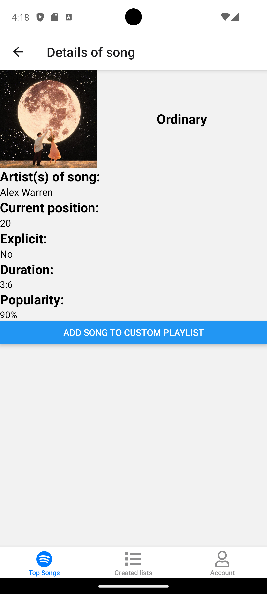
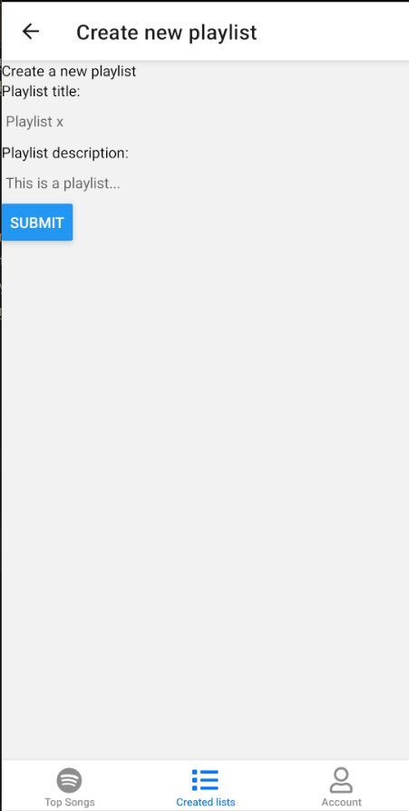

# Permanente evaluatie

**Vul hieronder verder aan zoals beschreven in de [projectopgave](https://javascript.pit-graduaten.be/evaluatie/mobile/pe.html).**

## Scherm 1

**Uitleg screenshot:**
Dit eerste scherm zal het startscherm van de applicatie worden. 
Op het scherm, wordt er via de Spotify-API (zie online services), de playlist 'Ultratop 50 Singles - Vlaanderen' opgehaald,
waarna deze op het scherm worden getoond in een apart item (zoals op screenshot, de styling van de items is tijdelijk, kan later nog veranderen).
Het is ook mogelijk om te scrollen om naar beneden om de rest van de items te bekijken, die in de playlist zitten. 
Het is ook mogelijk om op een item te drukken om naar een detailpagina (scherm 2) te gaan waar de details worden getoond van de song die je hebt gekozen.

## Scherm 2

**Uitleg screenshot:**
Dit tweede scherm, is zoals al eerder vermeld, de detailpagina van een item vanop het eerste scherm.
Hier zul je onder andere de foto van het lied kunnen zien, samen met de artiesten, de lengte van de song, of het liedje expliciet is of niet (scheldwoorden gebruikt of niet), huidige positie van de song...
De layout hoe het er nu uit ziet is tijdelijk en zal zeker nog veranderen. Op deze pagina zal ook een knop staan om het lied in kwestie toe te voegen aan je eigen playlist, die je zal kunnen maken als je bent ingelogd 

## Scherm 3

**Uitleg screenshot:**
Het derde scherm zal enkel beschikbaar zijn als je bent ingelogd met een account. Als dit het geval is,
dan zal je de eerste foto te zien krijgen. Je krijgt een knop te zien met een tekst 'No playlists'. 
Uiteraard, zal er, als je op de knop drukt, een playlist worden gemaakt, voorlopig met test-data. 
Later zal dit naar een create-pagina gaan om zo een playlist aan te maken (zie scherm 4)' 
Zodra er een playlist wordt aangemaakt, zal de tekst veranderd worden en zal je de tweede foto te zien krijgen.
Je zal een kruisje te zien krijgen bij de playlist, als je hierop zou drukken dan zal de playlist ook verwijderd worden uit de lijst.
Indien mogelijk, kan er eventueel nog een popup komen die vraagt of je de playlist weldegelijk wilt verwijderen, een soort bevestiging dus.

Als je niet zou zijn ingelogd dan krijg je de derde foto te zien waarop tekst staat die zegt dat je moet ingelogd zijn.

## Scherm 4

**Uitleg screenshot:**
Dit 4de scherm is de create pagina van de playlists, waar je het form kunt invullen.
Dit formulier bestaat dus uit een titel en een beschrijving van de playlist, die ook in de interface van IPlaylist, worden meegegeven,
zodat er objecten met deze properties kunnen gemaakt worden. De styling van het formulier is nog niet finaal, maar verandert zeker nog.
Je ziet ook een knop onderaan de pagina genaamd 'Submit', dit zal simpelweg de functie 'createPlaylist' uitvoeren (zie playlist.ts), en zal ook gebruik maken van de 'useRouting' hook 
om te navigeren naar de vorige pagina '..'.

## Scherm 5

**Uitleg screenshot:**
Dit vijfde scherm is het account-scherm. Als je nog geen account zou hebben, dan zal je de eerste foto te 
zien krijgen. Je zal daar 2 knoppen krijgen die je ofwel brengen naar een inlog-pagina of een pagina waar je kunt registeren.
Voorlopig werken deze pagina's nog niet helemaal, maar ik denk dat ik deze wel kan laten werken door eventueel Firebase authenticatie te gebruiken. 

Als je wel ben ingelogd dan zal je de tweede foto te zien krijgen. Hier zal je een overzicht krijgen van je gegevens zoals je 'username', paswoord, en email-adres. 
Hoe dat de pagina er nu uitziet is tijdelijk en zal hoogstwaarschijnlijk wel aanpassen qua styling. Dat geldt ook voor de 2 knoppen op foto 1.

## Scherm 6

**Uitleg screenshot:**
Dit scherm krijg je als op de 'Login' knop drukt. 
Als je al geregistreerd bent, dan hoef je hier gewoonweg je username en wachtwoord in te voeren en dan op de 'Login' knop te drukken.
Bij een druk op de knop zal je dus terug gebracht worden naar je account-overzicht (zie vorig scherm)' met de juiste gegevens. Zoals alle schermen,
is de styling tijdelijk, en zal dus zeker veranderen.

Voorlopig werkt de functionaliteit ook nog niet 100%, dus hier zal ook nog moeten aan getweaked worden, als ik dit wil laten werken,
eventueel door gebruik van Firebase bijvoorbeeld, zoals hierboven al vermeld.

## Scherm 7

**Uitleg screenshot:**
Naast de 'Login' knop, kom je dit scherm terecht als je op de 'Register' knop drukt.
Hier kan je een email, username, passwoord invoeren die je wilt gebruiken. 
Bij een druk op de 'Create account' knop, zal je ook worden teruggebracht naar je account-overzicht, opnieuw met de juiste info ingevuld.

Voorlopig werkt de functionaliteit hier ook nog niet 100%, dus hier zal ook nog moeten aan getweaked worden, als ik dit wil laten werken,
eventueel door gebruik van Firebase bijvoorbeeld, zoals al eerder vermeld.

## Native modules
Voorlopig zijn er nog geen native modules in de applicatie verwerkt, 
maar ik wil een native module voor de camera toevoegen, zodat je zelf foto's kunt nemen,
die dan als afbeelding kunnen worden gebruikt voor de eigen gemaakte playlist of misschien als profielfoto.

Daarnaast wil ik ook nog wel proberen de native-module van de galerij toe te voegen, 
zodat je al reeds gemaakte afbeeldingen kunt kiezen voor de playlist / profielfoto

## Online services

**1. Spotify API**
Met deze app maak ik gebruik van de Spotify API, die wordt gebruikt om de 'Top Songs' pagina op te vullen.
Er wordt met deze API, een api-key opgehaald en er wordt vervolgens een playlist opgehaald via een bepaalde id. 
In die functie, waar ik de playlist ophaal, vul ik de array op (gemaakt op basis van het 'ITrack' model), met de juiste waardes.
Uiteindelijk krijg ik dus een array terug met alle items die je op de eerste pagina ziet, met enkel de properties van het model en niet alle andere properties die de API 
teruggeeft.

Ik wil zeker nog wel een 2de online service gebruiken, maar ik ben nog niet zeker welke dit juist is (Firebase, MKKV...)

## Gestures & animaties
Voorlopig heb ik nog niet echt een concreet idee hoe ik gestures en animaties wil toevoegen, maar 
ik denk dat ik deze tegen het einde wil invoegen, nadat al de rest al is gemaakt. Een ideetje is misschien
om per item op de playlist pagina, een swipe-gesture toe te voegen, om zo een item te verwijderen, meer opties te tonen (edit, delete)...

# Feedback

**Wordt verder aangevuld door jouw docent.**

