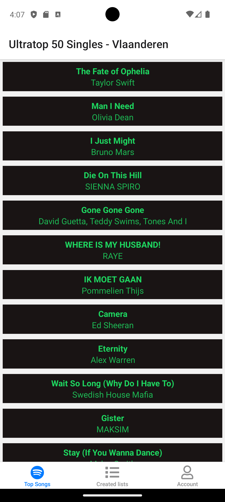
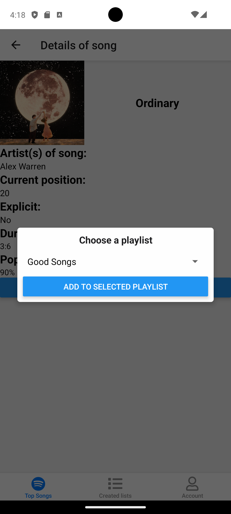
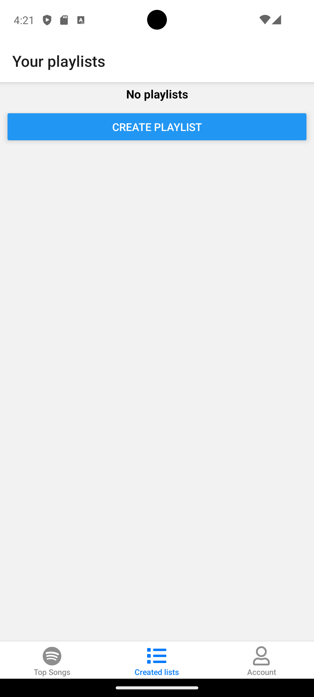
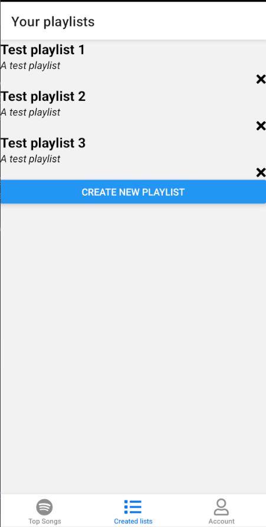
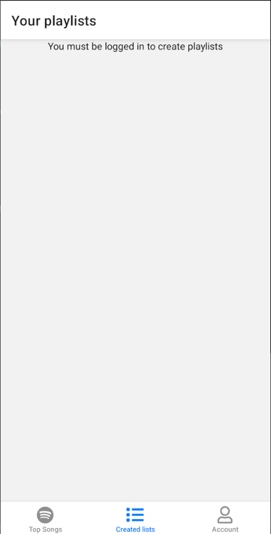
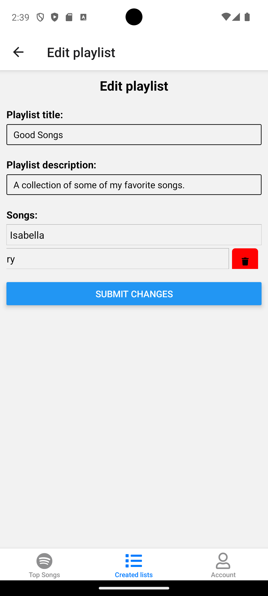
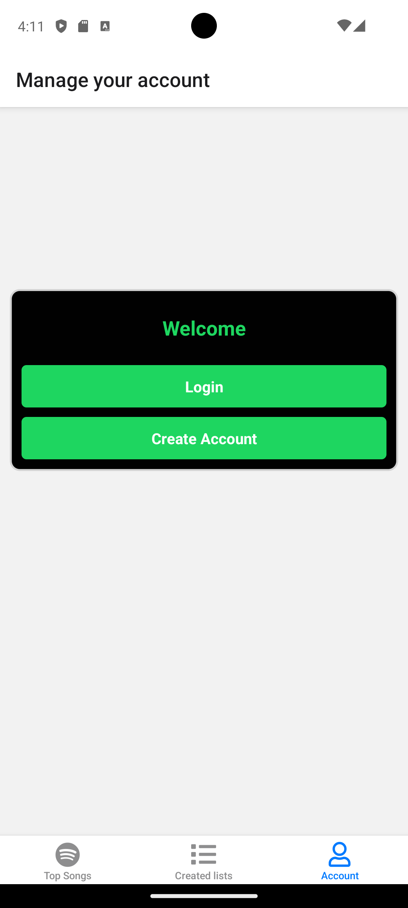
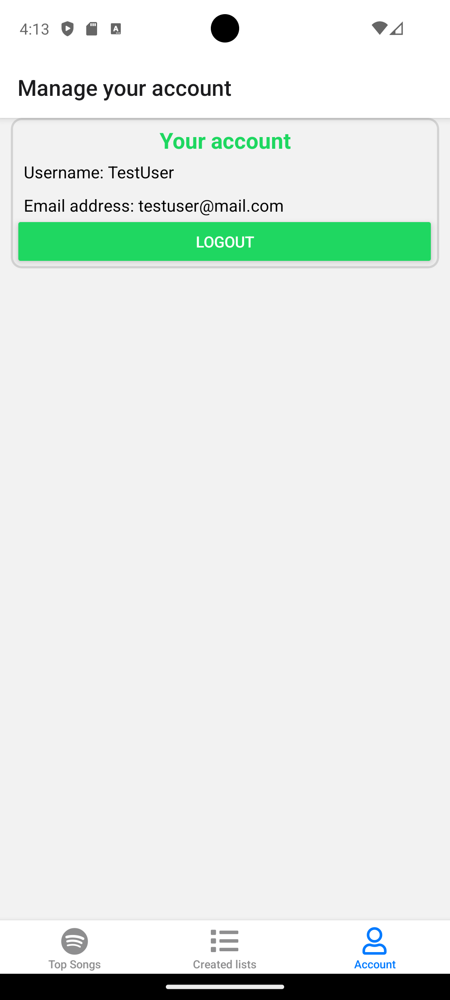
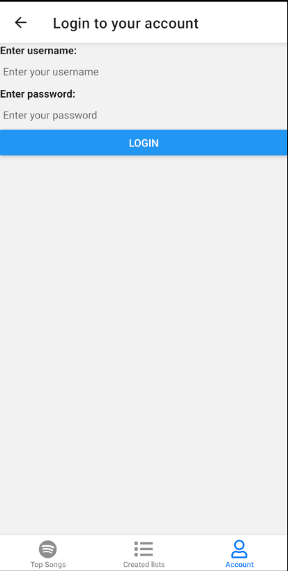
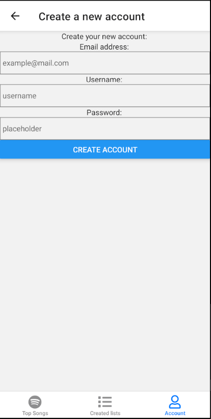

# Functionalities
I'm aware that the app doesn't look "finished" yet.

The current interface is primarily intended to properly test all the features and clearly display the data.
If I were to fully complete this app and actually release it later, the first thing I would do would be to address the look and feel to make it modern and attractive.

## Screen 1
<table>
  <tr>
    <td width="300">
      
    </td>
    <td style="vertical-align: top;">
      

        This first screen is the app's home screen and essentially forms the foundation of the app.
        The current playlist, "Ultratop 50 Singles - Vlaanderen," is retrieved via a connection to the 
        <strong>Spotify API</strong>. The data is dynamically rendered in a clear list.
      

      <ul>
        <li><strong>Interaction:</strong> Users can scroll through the list to explore the full top 50.</li>
        <li><strong>Navigation:</strong> When selecting a specific song, the user is redirected to its specific details page.</li>
        <li><strong>API Operation:</strong> This app communicates directly with the Spotify API to retrieve all data. The file <code>api/spotifyApi.ts</code> contains all the reusable functions I call throughout the application.</li>
      </ul>
    </td>
  </tr>
</table>

## Screen 2
<table>
  <tr>
    <td width="300">
      
        
      
    </td>
    <td style="vertical-align: top;">
      <h3>Explanation screenshot: </h3>
      

        The details page offers a more in-depth look at the selected song. It displays metadata such as album art, artist information, track length, and the 'explicit' status. This screen also serves as verification that the API data is being retrieved and assigned correctly.
        This page also contains a button that allows you to add the song to your own playlist, which you can create if you are logged in. If you are not logged in, you will not see this button.
      

      <ul>
        <li><strong>Conditional rendering:</strong> The button to add a song to a playlist is only visible to logged-in users, creating a personalized interface.</li>
        <li><strong>Interaction:</strong> The add button allows the user to add the song to their own playlist in the <strong>Firestore database</strong>. This is done via a modal (<code>app/components/playlist/modalPopUp.ts</code>) that shows an overview of all available playlists. If the user has not yet created any playlists, the <code>Picker</code> component will remain empty.</li>
        <li><strong>Navigation:</strong> The 'Back' button and automatic redirects after a successful action ensure a smooth user flow back to the homepage.</li>
      </ul>
    </td>
  </tr>
</table>

## Screen 3
<table>
  <tr>
    <td width="300">
      
    </td>
    <td style="vertical-align: top;">
      <h3>Explanation screenshot: </h3>
      

        This screen displays an overview of personal playlists for logged-in users. If there is no data yet and therefore no playlists have been created, the user will see a "No playlists" message with a direct option to create a first playlist.
      

      <ul>
        <li><strong>Interaction:</strong> The 'Create new playlist' button takes the user to the form on screen 4 for adding a new playlist.</li>
        <li><strong>Navigation:</strong> Clicking one of the icons at the bottom will take you to the corresponding page.</li>
      </ul>
    </td>
  </tr>
  <tr>
    <td width="300">
      
    </td>
    <td style="vertical-align: top;">
      <h3>Explanation screenshot: </h3>
      

        Once playlists are created, they will be displayed here dynamically. Users can manage their playlist collection by removing playlists via the "X" icon in the top right corner of a playlist, which will immediately update the list in the UI.
      

      <ul>
        <li><strong>Interaction</strong>: When a playlist is successfully created, the user receives a confirmation alert, providing clear feedback.</li>
        <li><strong>CRUD functions</strong>: This screen demonstrates the 'Read' and 'Delete' functions within the app.</li>
      </ul>
    </td>
  </tr>
  <tr>
    <td width="300">
      
    </td>
    <td style="vertical-align: top;">
      <h3>Explanation screenshot: </h3>
      

        Because I had to work with authentication as a requirement, this screen is hidden from non-logged-in users. They'll see a clear message that authentication is required to view or create playlists. In other words, they must first log in with their account before they can do anything in the application.
      

      <ul>
        <li><strong>Authentication</strong>: The app checks the user's authentication status before invoking playlist data retrieval functions from the <strong>Firestore database</strong>.</li>
      </ul>
    </td>
</table>

## Screen 4
<table>
  <tr>
    <td width="300">
      
    </td>
    <td style="vertical-align: top;">
      <h3>Explanation screenshot: </h3>
        

            On this screen, users can create new playlists using a form. The entered title and description are linked to the <code>IPlaylist</code> interface to ensure the data objects always have the correct properties.
        

        

            As mentioned earlier, the styling here is currently purely functional. As the app develops further, I would like to refine this form visually.
        

      <ul>
        <li><strong>Interaction</strong>: The 'Submit' button activates the <code>createPlaylist</code> function to save the data.</li>
        <li><strong>Navigation</strong>: After submitting, the <code>useRouter</code> hook is used to automatically redirect the user back to the overview on screen 3.</li>
        <li><strong>Security</strong>: Each playlist the user creates is linked to <strong>Firestore</strong> via a unique <code>userId</code>. This keeps the data strictly separated, and the playlists are unique to each individual user.</li>
      </ul>
    </td>
  </tr>
  <tr>
    <td width="300">
      
    </td>
    <td style="vertical-align: top;">
      <h3>Explanation screenshot: </h3>
      

        If the user were to tap on one of their playlists, they would have the option to make changes.
        They could edit the playlist title and description.
        Besides the title and description, the user will also see all the songs added to the playlist.
      

      <ul>
        <li><strong>Interaction</strong>: If you wish to remove one or more songs from the list, you can swipe a song to the left, after which a trash can icon will appear. Clicking this icon will not immediately delete the song; only after pressing the 'Submit' button will the songs be permanently deleted from the list and all changes will be submitted to the <code>Firestore database</code>.</li>
        <li><strong>Navigation</strong>: After confirming, the user will receive an alert, and the <code>useRouter</code> hook will be used to automatically return the user to the overview on screen 3. If you do not wish to make any changes, you can use the 'Back' button to return to the overview on screen 3.
      </ul>
    </td>
  </tr>
</table>

## Screen 5
<table>
  <tr>
    <td width="300">
      
    </td>
    <td style="vertical-align: top;">
      <h3>Explanation screenshot: </h3>
      

        This is your account screen. If you're not logged in yet, you'll see this overview with two clear buttons to log in or register.
      

      

        This and other account management pages use <strong>Firebase authentication</strong>. This allows users to manage their own profiles.
      

      <ul>
        <li><strong>Interaction</strong>: The buttons will take you to the login or registration page to test the app's flow.
      </ul>
    </td>
  </tr>
  <tr>
    <td width="300">
      
    </td>
    <td style="vertical-align: top;">
      <h3>Explanation screenshot: </h3>
      

        Once you're logged in, you'll see this overview of your account information, such as your username and email address.
      
 
      <ul>
        <li>
            <strong>Data processing</strong>: The account information is dynamically retrieved from the <strong>Firestore database<strong> to verify that the transfer between the app and the database is successful.
        </li>
      </ul>
    </td>
  </tr>
</table>

## Screen 6
<table>
  <tr>
    <td width="300">
      
    </td>
    <td style="vertical-align: top;">
      <h3>Explanation screenshot: </h3>
      

        This screen appears after clicking the "Login" button. Registered users can enter their email address and password to access their account.
      
 
      <ul>
        <li><strong>Interaction</strong>: When the 'Login' button is pressed, the user is returned to the account overview on screen 5.</li>
        <li><strong>Data processing</strong>: The account information is stored in the <strong>Firestore database</strong>, which is then retrieved when logging in.</li>
      </ul>
    </td>
  </tr>
</table>

## Screen 7
<table>
  <tr>
    <td width="300">
      
    </td>
    <td style="vertical-align: top;">
      <h3>Explanation screenshot: </h3>
      

        In addition to the 'Login' option, new users can create an account through this screen by providing an email address, username, and password.
      
 
      <ul>
        <li><strong>Interaction</strong>: When the 'Create account' button is pressed, the user is returned to the account overview, where the information they entered is immediately visible.</li>
        <li><strong>Data processing</strong>: The account information you enter as a user is stored in the <strong>Firestore database</strong>, so it can be retrieved later when logging in.</li>
      </ul>
    </td>
  </tr>
</table>

## Which native modules do I use in the app?
### The modal popup
To add songs to a playlist, I use the native `Modal` and `Picker` components.
The picker provides a familiar interface that adapts to the style of the current operating system, improving usability.

### Share menu na double-tap
Double-tapping one of the songs on the homepage invokes the operating system's Share API.
This opens the smartphone's standard share menu, allowing you to share the track's Spotify URL directly.

## Which online services do I use in the app?
### 1. Spotify API
In this app, I use the Spotify API, which dynamically populates the homepage.
The logic I've written involves retrieving an API key/access token so that a playlist can then be retrieved using a specific ID.
In this process, I populate the array, which is created based on the `ITrack` model, with the appropriate values.
Ultimately, I receive an array containing all the items you see on the first page, which only contains the `ITrack` properties and not all the properties returned by the API.

### 2. Firebase Auth / Firestore
In addition to the Spotify API, I also use Firebase Auth / Firestore.

Firebase Auth ensures orderly user management: upon registration, account information is securely stored, allowing users to easily log in on subsequent visits to the app.

Firestore serves as the database for user-created playlists.
This ensures that personal playlists and the songs added to them are preserved across sessions and thus always available.

Both the various IDs and credentials for the API and the Firebase configuration are loaded via a single `.env` file.
This guarantees security because this sensitive data is shielded from the public.
Therefore, the various values ​​in both `spotifyApi.ts` and `firebaseConfig.ts` are called via `process.env`, ensuring secure configuration.

## What gestures and/or animations are used?
The first gesture integrated into the app is the double-tap on the homepage.
Double-tapping one of the songs brings up the share menu, allowing users to instantly share the song's Spotify link with others.

There's also a swipe gesture on the playlist edit page, which we discussed earlier.
Swiping a song to the left reveals the option to remove it from the playlist.
Although the UI is only permanently updated after submission, the song is removed from the `Firestore database` in the background.
On your next visit, you'll see that the song has been removed from the list.